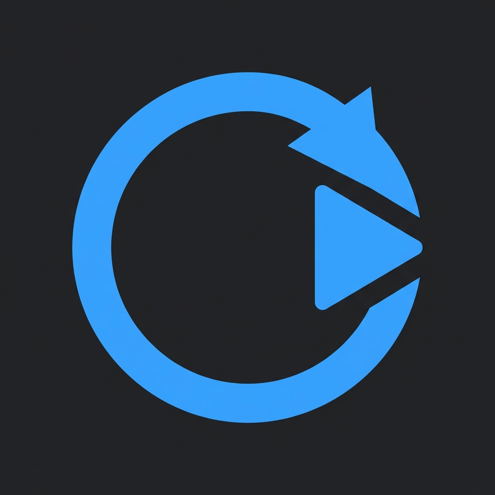

# 🔄 Shorts Auto Next

> **유튜브 쇼츠 영상이 끝나면 자동으로 다음 영상을 재생하는 Chrome 확장 프로그램**

<p align="center">
  
</p>

<p align="center">
  
  
  
  
</p>

---

## 🎯 해결하는 문제

유튜브 쇼츠는 영상이 끝나면 **자동 반복 재생**됩니다.  
다음 영상을 보려면 매번 스와이프하거나 클릭해야 하죠.

**Shorts Auto Next**는 영상이 끝나면 자동으로 다음 쇼츠로 넘겨줍니다.  
손을 쓰지 않고도 계속해서 새로운 영상을 즐길 수 있습니다! 🎉

### 이런 분께 추천해요
- 🏠 재택근무 중 BGM처럼 쇼츠를 틀어놓는 분
- 🍽️ 식사하면서 손 안 대고 쇼츠 보고 싶은 분
- 🎮 게임 로딩 중 쇼츠 자동 재생 원하는 분
- 💻 PC에서 쇼츠를 자주 시청하는 분

---

## ✨ 기능

| 기능 | 설명 |
|------|------|
| 🔄 **자동 다음 재생** | 쇼츠 영상 끝나면 자동으로 다음 영상 |
| 🎛️ **ON/OFF 토글** | 화면의 플로팅 버튼으로 간편하게 제어 |
| 💾 **설정 저장** | 브라우저를 닫아도 설정 유지 |
| 🌙 **다크 테마** | 유튜브와 조화로운 디자인 |

---

## 📸 스크린샷

<p align="center">
  
</p>

---

## 🚀 설치 방법

### 방법 1: Chrome 웹스토어 (출시 예정)
> 🔗 *출시 후 링크 추가 예정*

### 방법 2: 수동 설치 (개발자 모드)

1. **저장소 클론**
   ```bash
   git clone https://github.com/yourusername/shorts-auto-next.git
   ```

2. **Chrome 확장 프로그램 페이지 접속**
   - 주소창에 `chrome://extensions` 입력

3. **개발자 모드 활성화**
   - 우측 상단의 "개발자 모드" 토글 ON

4. **확장 프로그램 로드**
   - "압축해제된 확장 프로그램을 로드합니다" 클릭
   - 클론한 `shorts-auto-next` 폴더 선택

5. **완료!** 🎉

---

## 🎮 사용법

1. [YouTube Shorts](https://www.youtube.com/shorts) 페이지로 이동
2. 화면 **우측 하단**에 플로팅 버튼이 나타납니다
3. 버튼 클릭으로 자동재생 **ON/OFF** 전환
4. 영상이 끝나면 자동으로 다음 영상이 재생됩니다

```
🔵 ON  → 영상 끝나면 자동으로 다음 영상
⚫ OFF → 기본 유튜브 동작 (반복 재생)
```

---

## 📁 프로젝트 구조

```
shorts_auto_next/
├── manifest.json           # 확장 프로그램 설정 (Manifest V3)
├── src/
│   ├── background/         # 서비스 워커
│   │   └── service-worker.js
│   ├── content/            # 콘텐츠 스크립트
│   │   ├── content.js      # 메인 스크립트
│   │   ├── autoplay.js     # 자동재생 로직
│   │   └── ui.js           # 플로팅 UI
│   ├── popup/              # 팝업 UI
│   │   ├── popup.html
│   │   ├── popup.js
│   │   └── popup.css
│   └── styles/
│       └── floating-ui.css # 플로팅 버튼 스타일
├── assets/
│   ├── icons/              # 확장 프로그램 아이콘
│   └── store/              # 스토어 에셋
├── docs/
│   ├── PRD.md              # 제품 요구사항 문서
│   ├── PRIVACY_POLICY.md   # 개인정보처리방침
│   └── working_list.md     # 작업 기록
└── scripts/
    └── package.sh          # 패키징 스크립트
```

---

## 🛠️ 기술 스택

| 항목 | 기술 |
|------|------|
| **Platform** | Chrome Extension (Manifest V3) |
| **Language** | JavaScript (Vanilla) |
| **Storage** | Chrome Storage Sync API |
| **Browser** | Chrome, Edge (Chromium 기반) |

---

## 📋 로드맵

### MVP (v1.0) ✅
- [x] 자동 다음 재생
- [x] ON/OFF 토글
- [x] 설정 저장

### 향후 계획
- [ ] 🚫 관심없음 버튼
- [ ] 🔇 특정 채널 자동 스킵
- [ ] ⌨️ 키보드 단축키
- [ ] ⏱️ 자동 넘김 딜레이 설정

---

## 🔒 개인정보 보호

Shorts Auto Next는 **어떠한 개인정보도 수집하지 않습니다**.

- ✅ 모든 설정은 로컬에만 저장됨
- ✅ 외부 서버 연결 없음
- ✅ 사용자 데이터 수집 없음

자세한 내용은 [개인정보처리방침](docs/PRIVACY_POLICY.md)을 참조하세요.

---

## 🤝 기여하기

버그 리포트, 기능 제안, PR 모두 환영합니다!

```bash
# 1. Fork 하기
# 2. Feature 브랜치 생성
git checkout -b feature/amazing-feature

# 3. 커밋
git commit -m 'Add amazing feature'

# 4. Push
git push origin feature/amazing-feature

# 5. Pull Request 열기
```

### 이슈 제보
- 🐛 버그 발견 시 → [Issues](../../issues)에 등록해 주세요
- 💡 기능 제안 → [Issues](../../issues)에 `enhancement` 라벨로 등록해 주세요

---

## 📄 라이선스

MIT License - 자유롭게 사용하세요!

자세한 내용은 [LICENSE](LICENSE) 파일을 참조하세요.

---

## 👤 개발자 정보

- **이름**: Chris Park
- **이메일**: bboman21@gmail.com
- **GitHub**: [@bboman21](https://github.com/bboman21)

---

<p align="center">
  ⭐ 유용하셨다면 Star를 눌러주세요!
</p>

<p align="center">
  Made with ❤️ for YouTube Shorts lovers
</p>
